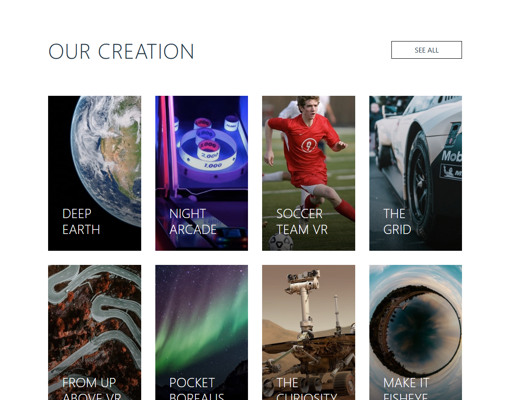
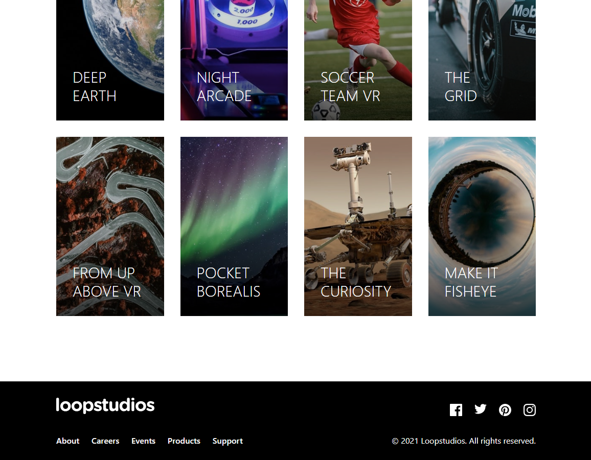

# Frontend Mentor - Loopstudios landing page solution

This is a solution to the [Loopstudios landing page challenge on Frontend Mentor](https://www.frontendmentor.io/challenges/loopstudios-landing-page-N88J5Onjw). Frontend Mentor challenges help you improve your coding skills by building realistic projects.

## Table of contents

- [Overview](#overview)
  - [The challenge](#the-challenge)
  - [Screenshot](#screenshot)
  - [Links](#links)
- [My process](#my-process)
  - [Built with](#built-with)
  - [What I learned](#what-i-learned)
  - [Continued development](#continued-development)
  - [Useful resources](#useful-resources)
- [Author](#author)
- [Acknowledgments](#acknowledgments)

## Overview

### The challenge

Users should be able to:

- View the optimal layout for the site depending on their device's screen size
- See hover states for all interactive elements on the page

### Screenshot

### Links

- Solution URL: [Add solution URL here](https://your-solution-url.com)
- Live Site URL: [Add live site URL here](https://your-live-site-url.com)

## My process

### Built with

- Semantic HTML5 markup
- CSS custom properties
- Flexbox
- CSS Grid
- Mobile-first workflow
- [React](https://reactjs.org/) - JS library
- Tailwind CSS - For utility-first styling
- Responsive design principles

### What I learned

This project helped me strengthen several key frontend development skills:

#### 1.Responsive Image Handling:

I learned how to handle images with different aspect ratios across breakpoints:

#### 2. Mobile Navigation Implementation:

Implemented a fully functional mobile hamburger menu with smooth transitions:
const [isOpen, setIsOpen] = useState(false);

return (
<>
<button
className="block lg:hidden relative z-50 bg-transparent"
onClick={() => setIsOpen(!isOpen)} >
{isOpen ? <X className="w-6 h-6 text-white" /> : <Menu className="w-6 h-6 text-white" />}
</button>
{isOpen && (

{/_ Mobile menu content _/}

)}
</>
);

#### 3.Complex Layout Positioning:

  {/* Overlapping text content */}

#### 4.Responsive Grid Systems:

Created a flexible grid that adapts from single column on mobile to four columns on desktop:

  {creations.map((creation, index) => (
    // Grid items
  ))}

### Useful resources

- Tailwind CSS Documentation - Essential for understanding utility classes and responsive design patterns.
- React Documentation - Helped with hooks and component patterns.
- CSS-Tricks - A Complete Guide to Grid - Great reference for CSS Grid layouts.
- MDN Web Docs - Object-fit - Helped understand image sizing and positioning.

## Author

- Website - Kha Tu Pham
- Frontend Mentor - [@KhaTuPham](https://www.frontendmentor.io/profile/khatupham1996)
